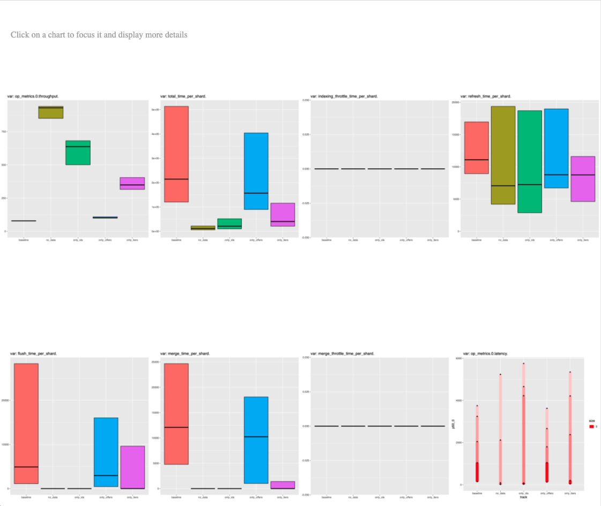

# ES Rally Tournament (ggplot2 report)

In order for this to work you have to have ES Rally configured to store the results in ES.

```bash
# 1. run ES Rally with necessary user tags
TOURNAMENT_ID=$(uuidgen)
for TRACK_NAME in {baseline,contender1,contender2}; do
  esrally race --track-path="./tracks/$TRACK_NAME" --pipeline=benchmark-only --target-hosts=$TARGET_HOST --on-error=abort --user-tag="track_name:$TRACK_NAME,tournament_id:$TOURNAMENT_ID"
done

# 2. get ES Rally results
curl -X GET http://localhost:9200/rally-races-\*/_search -H 'Content-type: application/json' -d '
{
  "query": {
    "match": { "user-tags.tournament": "'"${TOURNAMENT_ID}"'" }
  }
}' > races.json

# 3. get an environment with the necessary R packages
nix-shell -p "rWrapper.override { packages = with rPackages; [ ggplot2 tidyr ggpubr rjson ]; }"

# 4. convert ES data into CSV
./es-to-csv.sh < races.json > data.csv

# 5. generate plots
Rscript ./rnotebook.r

# 6. view result
open ./index.html
```


